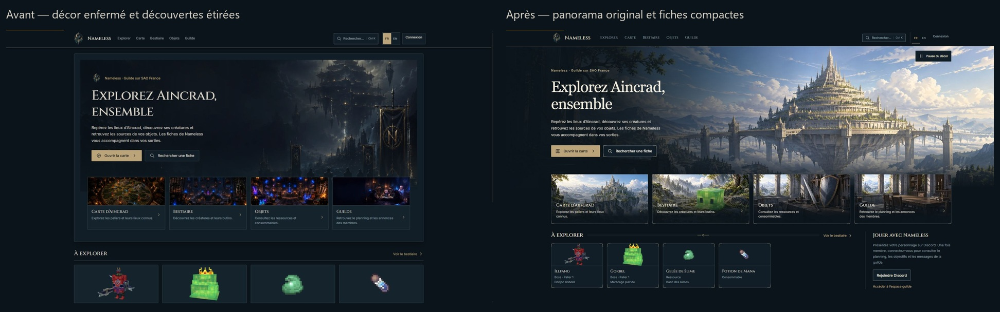
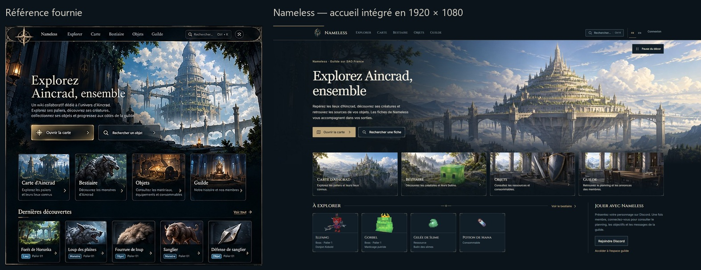

# Nameless — accueil et production artistique du 8 octobre 2026

> Historique : cette direction peinte a été remplacée à la demande de l’utilisateur par la [correction SAO/Minecraft](../sao-minecraft-home-2026-10-08/REPORT.md). Les WebP rejetés sont conservés dans `superseded-served/` et ne sont plus inclus dans le site construit. Les PNG sources restent disponibles pour tracer cette itération.

Cette passe reconstruit l’accueil autour d’un panorama original et d’une collection de quatre illustrations. Le décor occupe la largeur de l’écran ; le titre, la description et les actions restent du HTML. Les accès illustrés chevauchent le raccord inférieur et les découvertes prennent la forme de petites fiches de 204 px au maximum. L’introduction de la guilde devient une colonne secondaire ouverte. La navigation partagée conserve le logo officiel et reçoit une hiérarchie plus fine.

## Comparaison visuelle

La comparaison porte sur les proportions et la hiérarchie, comme demandé. La planche fournie n’est pas une capture native en 1920 : son écran d’accueil est extrait et présenté à côté de la nouvelle page, sans déformation. L’ancien rendu est la capture conservée de la passe précédente. Les illustrations fictives de cette planche ne sont pas utilisées comme données du site.

| Point | Écart initial | Résultat intégré |
| --- | --- | --- |
| Hero | Paysage sombre dans deux enceintes rectangulaires | Panorama ouvert, architecture éclairée à droite, texte sur premier plan calme à gauche |
| Profondeur | Détails concentrés dans une petite zone sombre | Plans distincts : terrasse, reliefs, forteresse à paliers et ciel |
| Accès | Photo séparée du bloc de texte | Titres et descriptions intégrés au bas des quatre scènes harmonisées |
| Découvertes | Grands panneaux et textures agrandies | Fiches compactes ; items de 47 × 48 et 46 × 46 px natifs ; rendus de boss limités à 108 × 88 px |
| Navigation | Grande barre et commandes disparates | 64 px desktop / 60 px mobile, logo 44 px, liens Cinzel, sélection fine, recherche dans une cible 44 px |
| Cadres | Conteneurs bordés imbriqués | Sections ouvertes ; un cadre par fiche, angles vectoriels courts et séparateur discret |

Deux corrections ont suivi la première intégration : les grands arcs du premier SVG ont été remplacés par des angles de 13 px, puis les slots de titre et description ont été stabilisés, notamment à 481–600 px. Le cadrage mobile du panorama a ensuite été produit à partir de la zone du monument plutôt que de télécharger une terrasse invisible.

## Illustrations et sources

La [bible artistique](ART_BIBLE.md) a été écrite avant la production. Les cinq images ont été produites avec l’outil intégré **image_gen**, puis inspectées isolément et dans l’interface. Les prompts sont conservés dans [HERO_PROMPT.md](HERO_PROMPT.md) et [navigation-prompts.json](navigation-prompts.json). Les sources PNG sont dans `sources/` et exclues du site public construit.

Le panorama original représente une interprétation d’ambiance d’Aincrad : paliers, arcades, ponts, reliefs et ciel lumineux. La scène Carte est une illustration d’exploration. Le Petit Slime de l’entrée Bestiaire conserve le cube vert et les deux yeux carrés de sa référence réelle. Objets montre un atelier avec équipement général ; Guilde montre une salle vide. Ces décors de navigation ne remplacent aucune icône d’item, donnée cartographique, position ou information de créature.

Le logo officiel, les rendus réels d’Illfang/Gorbel et les PNG transparents des items sont conservés. Une variante de logo 64 px allège la navigation. La vue Minecraft de ville employée pendant la première comparaison a été remplacée par le panorama original ; ses fichiers de service provisoires ont été retirés.

Les [manifest du panorama](landscape-manifest.json), [manifest de navigation](navigation-art-manifest.json) et [manifest du logo](nav-logo-manifest.json) enregistrent dimensions, poids et SHA. Les scripts `tools/optimize-home-landscape.py` et `tools/optimize-navigation-art-v2.py` produisent les variantes sans repeindre les sources. Le mobile possède un recadrage enregistré de 640 × 541 px. Les quatre miniatures 512 px représentent ensemble **126 330 octets** ; les quatre 256 px, **36 666 octets**.

| Fichier créé | Type / dimensions | Poids | Utilisation |
| --- | --- | ---: | --- |
| `assets/illustrations/aincrad-panorama-v2-2172.webp` | WebP 2172 × 724 | 252,078 o | Hero de l’accueil |
| `assets/illustrations/aincrad-panorama-v2-1600.webp` | WebP 1600 × 533 | 156,324 o | Hero de l’accueil |
| `assets/illustrations/aincrad-panorama-v2-960.webp` | WebP 960 × 320 | 69,988 o | Hero de l’accueil |
| `assets/illustrations/aincrad-panorama-v2-mobile.webp` | WebP 640 × 541 | 52,090 o | Hero de l’accueil |
| `assets/illustrations/map-v2-256.webp` | WebP 256 × 144 | 10,204 o | Navigation map |
| `assets/illustrations/map-v2-512.webp` | WebP 512 × 288 | 35,472 o | Navigation map |
| `assets/illustrations/map-v2-768.webp` | WebP 768 × 432 | 73,842 o | Navigation map |
| `assets/illustrations/bestiary-v2-256.webp` | WebP 256 × 144 | 12,072 o | Navigation bestiary |
| `assets/illustrations/bestiary-v2-512.webp` | WebP 512 × 288 | 40,358 o | Navigation bestiary |
| `assets/illustrations/bestiary-v2-768.webp` | WebP 768 × 432 | 77,044 o | Navigation bestiary |
| `assets/illustrations/items-v2-256.webp` | WebP 256 × 144 | 7,264 o | Navigation items |
| `assets/illustrations/items-v2-512.webp` | WebP 512 × 288 | 24,664 o | Navigation items |
| `assets/illustrations/items-v2-768.webp` | WebP 768 × 432 | 48,768 o | Navigation items |
| `assets/illustrations/guild-v2-256.webp` | WebP 256 × 144 | 7,126 o | Navigation guild |
| `assets/illustrations/guild-v2-512.webp` | WebP 512 × 288 | 25,836 o | Navigation guild |
| `assets/illustrations/guild-v2-768.webp` | WebP 768 × 432 | 54,192 o | Navigation guild |

## Kit de composants

[UI_KIT.md](UI_KIT.md) décrit les classes, les conventions et les exemples HTML. Le kit comprend `css/components/mmorpg-kit.css`, `assets/ui/nameless-frame.svg`, `nameless-divider.svg` et `nameless-icons.svg`. Son total est **5 416 octets** avant compression HTTP. Six symboles SVG décrivent carte, bestiaire, objets, guilde, recherche et chevron.

Le cadre se compose d’une seule bordure et de quatre angles courts au trait de 1 px. Le séparateur accompagne une section ouverte. Les boutons gardent des cibles de 44 px, de vrais noms accessibles et le focus visible. La recherche utilise le panneau et le cadre communs. Les classes sont explicites et n’imposent pas de nouvelle composition aux autres pages.

## Animations

Le texte du hero apparaît une fois en 420 ms avec un déplacement de 8 px. Le panorama reçoit une dérive de caméra CSS de 36 secondes, entre 1,006 et 1,015 de zoom, avec un déplacement vertical de 0,15 %. Le bouton de pause arrête effectivement `animation-play-state` ; son nom est disponible en français et anglais. La préférence de réduction des mouvements supprime cette animation et désactive le contrôle. Les écouteurs sont nettoyés lorsque la navigation SPA quitte l’accueil.

Les cartes passent progressivement à 1,025 de zoom et à un éclairage de 1,07 au survol ou au focus. Le chevron avance de 3 px. Les petites textures d’items restent immobiles. La recherche conserve son ouverture native et sa transition courte ; flèches, Échap et retour du focus ont été contrôlés dans le navigateur.

## Validation

- `npm test` : suite complète passée, comprenant syntaxe JS, catalogues, i18n, recherche/router, SPA, sécurité isolée, contenu public et cycles Leaflet réels.
- Après optimisation et correction des libellés : `test-hybrid-home`, `test-hybrid-foundation`, `audit-i18n`, `test-i18n-dom` et `test-build-artifact` passés.
- Artefact final : 42 documents HTML vérifiés, 2 187 références locales, CSP et URLs historiques contrôlées.
- Sources et variantes hachées ; transparence des PNG réels conservée ; aperçu des SVG inspecté après intégration.
- 1920 × 1080 et 2560 × 1440 capturés exactement. Mobile 390 et 360 px, puis 481, 600, 768, 1024 et 1280 px contrôlés. Le seuil CSS 768 px a aussi été vérifié directement : menu mobile et variante de paysage correspondante.
- Navigation connectée testée à 360, 390, 769, 900 et 1024 px avec des fixtures locales en mémoire, sans compte ni API réels. Aucun débordement de header, et cible de déconnexion de 44 × 44 px.
- Recherche réelle « Illfang », flèche vers le résultat, Échap et retour au bouton du hero ; menu mobile fermé par Échap avec retour au bouton ; FR → EN → FR et absence de textes rognés.

Les mesures et rectangles sont conservés dans [responsive-qa.json](responsive-qa.json). La barre de défilement de l’aperçu Windows occupe 10 px : les contrôles de contenu et les captures ciblées compensent cette gouttière. Les dimensions des fichiers de capture ont été vérifiées directement.

| Lighthouse mobile local | Valeur finale |
| --- | ---: |
| Performance | 91 |
| Accessibilité | 100 |
| Bonnes pratiques | 100 |
| SEO | 100 |
| LCP | 3,5 s |
| Blocage du thread principal | 0 ms |
| Décalage de mise en page | 0 |
| Transfert | 485 KiB |

Rapport complet : [lighthouse-home-final.json](lighthouse-home-final.json). La première intégration était à 89 / 552 KiB ; les variantes plus légères et le cadrage mobile dédié ont réduit le transfert de 67 KiB.

## Captures finales

- [Desktop 1920 × 1080](screenshots/premium-1920.jpg)
- [Desktop 2560 × 1440](screenshots/premium-2560.jpg)
- [Mobile 390 px](screenshots/premium-390-full.jpg)
- [Mobile 360 px](screenshots/premium-360-full.jpg)
- [Mobile anglais](screenshots/premium-360-en.jpg)
- [Recherche mobile](screenshots/search-390.jpg)
- [Menu mobile](screenshots/menu-360.jpg)
- [Navigation connectée 360 px — fixture](screenshots/member-nav-360.jpg)

## Limites et suite du projet

La différence restante avec la référence concerne surtout les fiches de découverte : elles montrent les rendus Minecraft réels, et non des portraits peints nouvellement attribués aux boss. Leur traitement est volontairement distinct des illustrations générales de navigation. Le panorama source mesure réellement **2172 × 724 px** ; les variantes ne prétendent pas créer de résolution supplémentaire.

Aucune ressource indispensable à cette passe n’est bloquée par les outils disponibles. Lighthouse conserve un diagnostic secondaire déjà présent sur le nom accessible du lecteur audio en pied de page ; il ne concerne pas les nouveaux contrôles et n’affecte pas le score d’accessibilité obtenu. Les autres pages peuvent reprendre le kit lors des prochaines passes de composition ; leurs cartes, données et fonctionnalités n’ont pas été reconstruites ici.

Les modifications et le build sont locaux. Aucun déploiement en production, commit ou push n’a été effectué.
