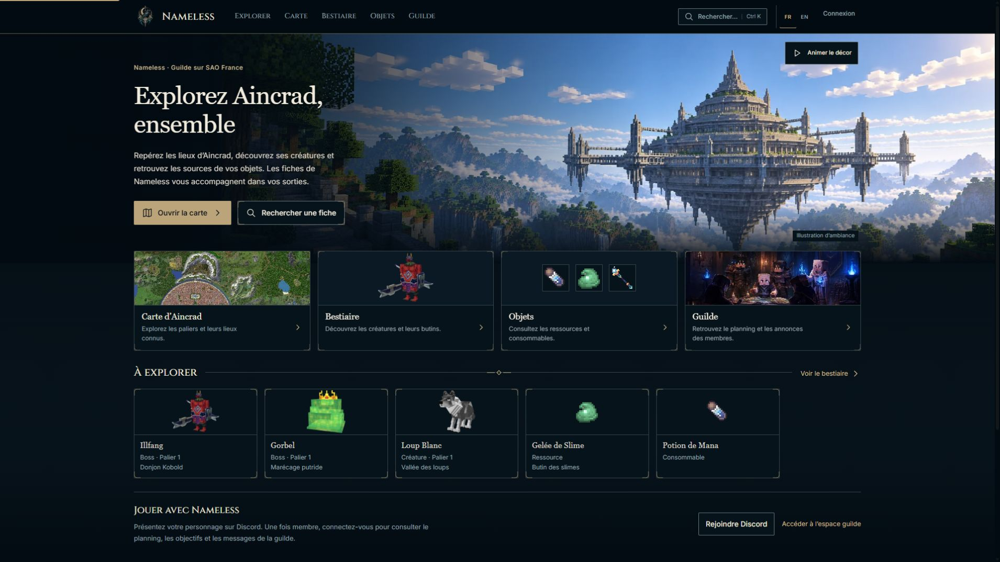

# Nameless — accueil Hybrid SAO Minecraft

La nouvelle composition de l’accueil est implémentée et vérifiée dans le navigateur. Le panorama présente une architecture en blocs inspirée d’Aincrad à droite, avec une zone calme pour le texte à gauche. Quatre cartes homogènes conduisent aux modules existants ; cinq vraies fiches composent la galerie ; la guilde devient un bloc horizontal secondaire. Les autres compositions restent pour leurs phases suivantes.

## Résultat visuel et comparaison

[Comparaison référence / avant / après](comparison-home.jpg) · [mobile complet](screenshots/home-390-full.jpg) · [planche des assets](asset-control-after.jpg) · [audit de départ](../phase-0/AUDIT.md).

| Critère | État de départ | Résultat observé |
|---|---|---|
| Hero | Ville aérienne centrée, ciel gris large, silhouette horizontale | Paliers en blocs, sommet et base visibles, point focal droit, profondeur de vallée, lumière naturelle localisée. Texte limité à 480 px. |
| Proportions | Hero proche de 500 px ; contenu large | Hero 420 px à 1280, 442 px à 1920, 460 px à 2560 ; largeur de contenu plafonnée à 1460 px. Les quatre accès et cinq fiches restent dans le viewport desktop classique. |
| Navigation | Images bord à bord, modèle isolé et sprites avec positions de texte différentes | Même bande d’art de 104 px et même pied de texte. Cartes 338,5 × 192 px à 1920 ; descriptions courtes, titres Georgia en casse courante, flèche discrète et focus visible. |
| Galerie | Quatre bandeaux en 2 × 2 | Cinq cartes verticales d’environ 237 × 172 px sur desktop, média de 88 px. Métadonnées réelles sous le nom ; aucune fausse récence. |
| Guilde | Colonne latérale concurrente | Ligne secondaire sous la galerie, texte et deux accès existants. Pas de faux planning public. |
| Palette et surfaces | Bleu-noir / or déjà proche de la planche | Tokens conservés, illustrations lumineuses localisées et fonds opaques ; sections ouvertes et séparateur simple. Pas de nouvelle décoration globale. |
| Mobile | Ville recadrée et bandeaux empilés | Cadrage spécifique sur le panorama, texte en dessous, actions de 44 px empilées, deux colonnes pour accès et fiches. |

La référence n’est pas copiée littéralement : son loup, ses armes, ses lieux et ses événements illustratifs ne deviennent pas des données Nameless. Les vrais modèles et sprites ont des médias adaptés à leurs silhouettes ; ils ne sont pas convertis en peintures fantasy. L’en-tête garde le logo corbeau validé et les modules existants.

Deux itérations ont corrigé des écarts concrets : le sommet coupé dans la première génération a été recadré ; la première intégration à quatre fiches a été complétée par le vrai Loup Blanc pour retrouver une galerie de cinq cartes. Les intitulés de cartes et le bloc guilde ont été réorganisés. Le cadrage des images utilise des classes stables : les liens deviennent absolus lors d’un retour SPA, ce qui ne doit pas modifier leurs règles CSS.

## Assets créés ou adaptés

| Fichier servi | Dimensions | Poids | Usage |
|---|---:|---:|---|
| `aincrad-minecraft-1920.webp` | 1920 × 641 | 201 012 o | Hero haute densité |
| `aincrad-minecraft-1440.webp` | 1440 × 481 | 125 134 o | Hero desktop courant |
| `aincrad-minecraft-960.webp` | 960 × 321 | 61 494 o | Variante intermédiaire |
| `aincrad-minecraft-mobile.webp` | 640 × 457 | 50 826 o | Crop mobile enregistré |
| `white-wolf-256.webp` | 256 × 291 | 14 760 o | Vignette du modèle réel `creature:12` |

Une seule nouvelle scène décorative a été produite avec l’outil intégré ImageGen, puis réparée pour le cadrage. Source réelle **2170 × 725**, conservée avec la première sortie et le [cahier des charges](../HERO_PROMPT.md). Le label visible « Illustration d’ambiance » indique qu’il ne s’agit pas d’une capture officielle du serveur.

Le [manifeste](../hero-manifest.json) enregistre crops, résolutions, poids et SHA. Les copies WebP sont redimensionnées proportionnellement sans agrandissement artificiel. La vignette du loup conserve exactement l’alpha redimensionné. Logo, carte, Illfang, Gorbel, scène voxel de guilde et trois PNG natifs sont réutilisés ; leurs originaux sont intacts. Les anciens assets restent restaurables. Aucun monstre ou équipement inventé n’a été ajouté.

## Responsive réellement observé

| Viewport demandé | JPEG d’origine | Hero DOM | Grille d’accès |
|---|---|---:|---|
| [360 × 800](screenshots/home-360.jpg) | 350 × 778 | 562 px | 2 colonnes, 153 × 208–225 px |
| [390 × 844](screenshots/home-390.jpg) | 380 × 822 | 546 px | 2 colonnes, 168 × 208 px |
| [768 × 1024](screenshots/home-768.jpg) | 758 × 1011 | 537 px | 2 colonnes, 348 × 189 px |
| [1280 × 900](screenshots/home-1280.jpg) | 1270 × 893 | 420 px | 4 colonnes, 291 × 192 px |
| [1920 × 1080](screenshots/home-1920.jpg) | 1910 × 1074 | 442 px | 4 colonnes, 338,5 × 192 px |
| [2560 × 1440](screenshots/home-2560.jpg) | 2560 × 1376 | 460 px | 4 colonnes, 338,5 × 192 px |

Les six largeurs DOM demandées sont vérifiées ; aucune ne déborde horizontalement. Les JPEG sont conservés tels que l’outil les exporte, avec leurs dimensions réelles, sans les agrandir pour correspondre au nom du fichier. [Protocole et limitation de capture](../CAPTURE_PROTOCOL.md) · [mesures DOM](responsive-dom.json) · [manifeste JPEG](../screenshot-manifest.json).

Les captures mobile/tablette ont été ouvertes et inspectées, y compris la [page mobile complète](screenshots/home-390-full.jpg), l’[anglais](screenshots/home-390-en.jpg), le [menu anglais](screenshots/menu-390-en.jpg) et la [recherche](screenshots/search-390.jpg). Les images différées ont été chargées et vérifiées. Le décor a été mis en pause pour les comparaisons.

## Interactions et non-régression

- Clics réels depuis l’accueil vers carte, bestiaire, objets et espace guilde, puis retour. Le namespace `.home-page` est retiré hors accueil.
- Fiche Loup Blanc ouverte sur `?creature=12` : zone Vallée des loups et données du catalogue. Fiche Potion de Mana sur `?item=potion_mana` : l’absence de source confirmée est affichée sans invention.
- Fiche boss Illfang locale et rafraîchissement profond fonctionnels. Sa version publique reste introuvable : voir l’audit de publication.
- Recherche « Illfang », flèche bas vers le résultat, Échap et retour du focus au bouton du hero.
- Menu mobile avec contenu principal inerte pendant l’ouverture ; Échap ferme et rend le focus. Le libellé accessible suit désormais FR/EN et l’état ouvert/fermé, y compris après changement de langue.
- Pause du mouvement dans le navigateur ; `prefers-reduced-motion`, listeners SPA, chargement différé et erreur de recherche couverts par les tests DOM.
- Accès guilde en visiteur : refus d’accès affiché. Les données membres de l’audit proviennent uniquement d’une fixture QA isolée. Aucun formulaire privé ou événement réel n’a été soumis.

[Journal des interactions](interaction-checks.json) · [routes et retours](interaction-routes.json).

`npm test` passe après le correctif de menu : syntaxe, traductions, catalogue, recherche/router, carte/Leaflet, règles de publication, dates, médias et 26 contrôles de sécurité en base isolée. Le test d’accueil et le build ont été relancés après la correction des classes de cadrage. Build final : **12 routes, 18 boss, 326 entrées**, 42 documents HTML et 2 183 références locales vérifiées. Le nouveau test d’archives garantit les sept SHA et la conservation des octets via le filtre Git.

## Performance et limites

| Lighthouse mobile local final | Résultat |
|---|---:|
| Performance | 90 |
| Accessibilité | 100 |
| Bonnes pratiques | 100 |
| SEO | 100 |
| FCP | 1,05 s |
| LCP | 3,71 s |
| Blocage principal | 0 ms |
| CLS | 0,002 |
| Transfert mesuré | 455 KiB |

[Rapport Lighthouse](lighthouse-home.json) · [résumé](performance-summary.json). Mesure de laboratoire simulée sur localhost, pas des Core Web Vitals de visiteurs. Le LCP reste au-dessus de la cible de 2,5 s ; les chargements communs et polices devront encore être optimisés dans la phase performance. Aucun score ne sert de preuve de fidélité artistique. La mesure antérieure de l’accueil avait aussi 90 en performance ; une seule mesure par version ne permet pas une conclusion statistique sur quelques dixièmes de seconde.

Écarts restants : les cartes utilisent volontairement des médias réels de formats différents, contrairement aux peintures homogènes de la référence. Les contours SVG/CSS restent sobres ; les détails décoratifs communs seront affinés en phase 2. En mobile, la cinquième fiche occupe seule la dernière ligne afin de conserver deux colonnes lisibles ; le hero plus haut laisse les actions visibles puis les cartes au début du défilement. Aucun nouveau module métier n’est ajouté pour remplir la page.

La refonte locale de l’accueil et son audit sont livrables. La publication publique est un problème distinct documenté : correction des archives préparée, réglages Pages/CDN et état Supabase distant non certifiés. **Aucun commit, push, déploiement ou migration de production effectué.** Les compositions carte, bestiaire/items et guilde attendent leurs phases après cette livraison.
