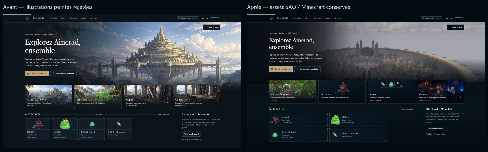
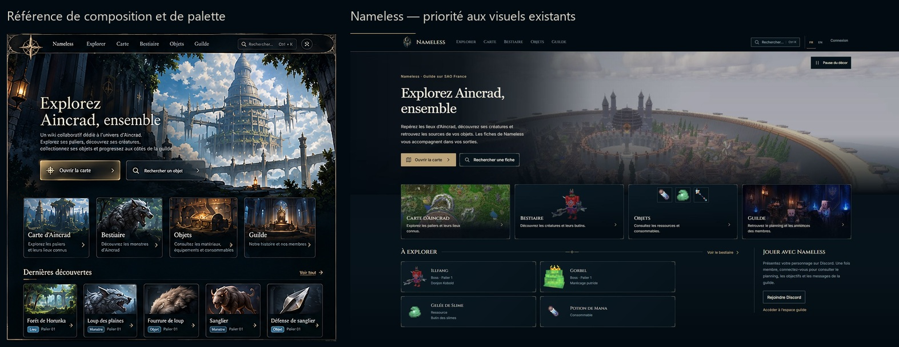

# Nameless — correction de l’accueil SAO / Minecraft

L’accueil utilise de nouveau les visuels existants du projet et des fichiers fournis. Les cinq illustrations peintes de la passe précédente ont été retirées de l’accueil et du build public. Aucun nouvel asset IA n’a été généré pour cette correction.

## Audit : conserver, améliorer, remplacer

| Décision | Assets et rôle |
| --- | --- |
| Conserver | Logo officiel au corbeau ; rendus Illfang et Gorbel ; les 104 PNG d’items et leur transparence ; les liens et métadonnées réels du catalogue |
| Améliorer | Vue Minecraft `font-page-city.png` pour le hero ; carte existante du palier pour la navigation ; recadrage de `caroussel_ensemble.webp` autour de la table et des personnages voxel |
| Remplacer | Panorama peint et quatre illustrations `v2` de la passe précédente ; ils sont archivés dans `docs/art-direction-2026-10-08/superseded-served/` et ne sont plus copiés dans `_site` |
| Présenter directement | Illfang dans l’entrée Bestiaire ; potion de mana, gelée de Slime et bâton du Shaman dans une petite grille d’inventaire HTML |

La carte, le rendu Illfang et la scène de guilde sont déjà présents depuis le premier commit du projet. Les copies `assets/brand/page-font-*` proviennent des anciens `font_nameless*`, mais leur ancienneté ne les rend pas automatiquement adaptées : les anciens fonds peints n’ont pas été repris arbitrairement.

## Palette et composition

Les mesures ont été prises dans les zones planes de la référence : navigation autour de `#01070B`, fond ouvert autour de `#000B12`, panneaux autour de `#010E16–#030E16`. Les surfaces actuelles sont désormais :

| Surface | Avant | Correction |
| --- | --- | --- |
| Fond | `#0B141B` | `#030B12` |
| Secondaire | `#111E27` | `#07131B` |
| Panneau | `#15232D` | `#0A1923` |
| Panneau élevé | `#1B303B` | `#112632` |

L’ivoire, le gris secondaire et l’or ancien sont conservés. Les contrastes texte/surface et contrôle/fond passent les vérifications AA du projet. Ces couleurs sont centralisées dans `css/tokens.css` et reprises dans les métadonnées de thème ; les autres pages bénéficient de la palette sans nouvelle refonte de leurs composants.

Le hero reste une section ouverte, d’environ 500–520 px sur les grands écrans. La ville Minecraft remplace la forteresse peinte. Un voile local protège le texte et le raccord inférieur ; l’architecture au centre est laissée lisible. Une présentation CSS modérée ajuste saturation et luminosité à 0,9, sans modifier les fichiers sources. Les cartes cliquables conservent leurs cadres fins et leurs vrais liens.

Les découvertes sont des fiches horizontales de 108 px de hauteur : image à gauche, nom, catégorie, palier et zone connue à droite. Deux colonnes sont utilisées lorsqu’il y a assez de place ; une colonne sur les mobiles étroits. Les petites textures conservent leurs dimensions natives. L’inventaire de catégorie a été corrigé après contrôle mobile pour séparer ses cases du titre « Objets ».

## Sources et variantes

La [fiche de production](asset-manifest.json) conserve les SHA, dimensions, poids, crops et contrôle d’alpha. `tools/optimize-sao-home.py` est reproductible à partir des mêmes sources : resize proportionnel, recadrage enregistré et compression WebP. Le PNG de ville est copié byte pour byte dans `sources/city.png` ; les sources de carte et de guilde restent intactes.

| Variante servie | Dimensions | Poids |
| --- | --- | ---: |
| `assets/home/sao-city-1920.webp` | 1920 × 1009 | 220,884 octets |
| `assets/home/sao-city-1600.webp` | 1600 × 841 | 151,128 octets |
| `assets/home/sao-city-960.webp` | 960 × 504 | 54,648 octets |
| `assets/home/sao-city-mobile.webp` | 640 × 539 | 52,616 octets |
| `assets/home/sao-map-512.webp` | 512 × 288 | 60,564 octets |
| `assets/home/sao-map-256.webp` | 256 × 144 | 13,094 octets |
| `assets/home/sao-guild-512.webp` | 512 × 291 | 21,308 octets |
| `assets/home/sao-guild-256.webp` | 256 × 146 | 6,788 octets |

Bestiaire réutilise `assets/home/illfang-256.webp`, dérivé du vrai rendu `assets/mobs/illfang.png`. Objets référence directement les PNG du catalogue, en 46 × 46, 47 × 48 et 48 × 48 px. Aucune icône d’item n’a été repeinte ni convertie. Le mobile masque simplement le troisième aperçu lorsque la largeur ne permet pas de le placer correctement.

## Comparaison visuelle

La référence guide les surfaces, les contrastes, les proportions et la hiérarchie. Les images de la maquette restent des illustrations de référence ; elles ne sont pas utilisées comme faux contenu de serveur. La nouvelle composition privilégie l’identité des fichiers Minecraft existants, même lorsque leur qualité ou leur lumière diffèrent de celle d’une peinture de la maquette.

Deux ajustements ont suivi la première capture : allègement du voile sur l’architecture centrale, puis correction de la respiration d’Illfang et des cases d’inventaire. La comparaison ne se limite donc pas à une compilation réussie.

## Vérification

- `npm test` passé : syntaxe, catalogue, i18n, recherche, SPA, contenu public, cycles Leaflet et sécurité isolée.
- 104 PNG d’items vérifiés : CRC, pixels RGBA et transparence identiques au manifest d’origine.
- 42 documents HTML et 2 181 références locales vérifiés dans le build, avec CSP et routes historiques.
- Nouveau test d’accueil : sources Minecraft hachées, recadrages proportionnels, alpha conservé, absence des peintures rejetées, vrais IDs d’items et de créature.
- Contrôles de largeur : 1920, 2560, 390, 360 et largeurs intermédiaires 481 / 600 / 768 / 1024 px. Aucun texte rogné ni débordement relevé. Les cases d’inventaire sont séparées de leur titre d’au moins 23 px dans les contrôles finaux.
- Recherche « Illfang », flèche vers le résultat, Échap et retour au bouton ; menu mobile fermé par Échap avec retour au bouton ; anglais en 360 px sans texte rogné.
- Le léger mouvement CSS existant reste désactivable et respecte les préférences de réduction des mouvements. La navigation et l’authentification gardent leurs hooks et leur comportement.

Preuves : [responsive-qa.json](responsive-qa.json) et [Lighthouse](lighthouse-home.json).

| Lighthouse mobile local | Résultat |
| --- | ---: |
| Performance | 90 |
| Accessibilité | 100 |
| Bonnes pratiques | 100 |
| SEO | 100 |
| LCP | 3,6 s |
| Blocage du thread principal | 0 ms |
| Décalage de mise en page | 0 |
| Transfert | 441 KiB |

La dernière modification des espacements de cartes a été vérifiée dans le navigateur après la suite complète. Le build final a réussi ; un verrou temporaire OneDrive sur l’index généré a demandé une relance, sans changement du générateur.

## Captures

- [Desktop 1920 × 1080](screenshots/home-1920.jpg)
- [Desktop 2560 × 1440](screenshots/home-2560.jpg)
- [Mobile 390 px complet](screenshots/home-390-full.jpg)
- [Mobile 360 px complet](screenshots/home-360-full.jpg)
- [Anglais 360 px](screenshots/home-360-en.jpg)
- [Première intégration avant correction du voile](screenshots/iteration-1-1920.jpg)

## Limites factuelles

Le fichier local de ville ne possède pas de provenance officielle ni de nom de zone établis dans les sources disponibles. Il est employé comme vue Minecraft d’environnement, sans le désigner comme une capitale ou un palier précis. La vraie carte du palier reste utilisée dans l’entrée Carte ; aucune position, créature, statistique ou donnée cartographique n’a été inventée.

Cette passe concerne l’accueil et les couleurs partagées. Les peintures rejetées sont conservées uniquement pour l’historique. Aucun déploiement, commit ou push n’a été réalisé.
